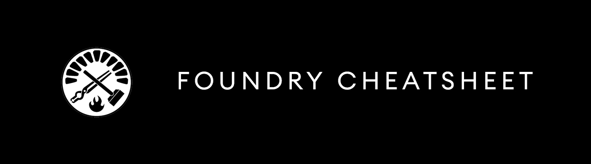

# Foundry Cheatsheet



Foundry GitHub - [https://github.com/foundry-rs](https://github.com/foundry-rs)   
Foundry Book - [https://book.getfoundry.sh/](https://book.getfoundry.sh/)   
Installing Foundry - [https://github.com/foundry-rs/foundry#installation](https://github.com/foundry-rs/foundry#installation)

Foundry is made up of three components:

[Forge](https://github.com/foundry-rs/foundry/tree/master/forge): Ethereum testing framework (like Truffle, Hardhat and DappTools).   
[Cast](https://github.com/foundry-rs/foundry/tree/master/cast): CLI for interacting with EVM smart contracts, sending transactions and getting chain data.   
[Anvil](https://github.com/foundry-rs/foundry/tree/master/anvil): local Ethereum node, similar to Ganache or Hardhat Network.

Forge includes both a CLI as well as a [standard library](https://github.com/foundry-rs/forge-std).

For an introduction to Foundry, check out these resources:

- [Foundry vs Hardhat: Differences in performance and developer experience](https://chainstack.com/foundry-hardhat-differences-performance/)
- [Smart Contract Development with Foundry (Video)](https://www.youtube.com/watch?v=uelA2U9TbgM)
- [Building and testing smart contracts with Foundry (tutorial)](https://nader.mirror.xyz/6Mn3HjrqKLhHzu2balLPv4SqE5a-oEESl4ycpRkWFsc)

For support, check out the Telegram channel [here](https://t.me/foundry_support)

## Initializing a new project

Initialize a new project from an empty folder:

```sh
forge init
```

Or define a new folder in which to create your project:

```sh
forge init my-app
```

This creates a new project with 4 folders:

__src__ - An example smart contract and where your smart contracts will live.

__script__ - An example deployment script

__test__ - An example test

__lib__ - This is similar to __node_modules__

### Remappings

Forge can remap dependencies to make them easier to import. Forge will automatically try to deduce some remappings for you:

```sh
$ forge remappings

ds-test/=lib/solmate/lib/ds-test/src/
forge-std/=lib/forge-std/src/
```

If you're using VS Code, you can configure your remappings by installing [vscode-solidity](https://github.com/juanfranblanco/vscode-solidity).

Learn more about how remappings work [here](https://book.getfoundry.sh/projects/dependencies.html?highlight=remappings#remapping-dependencies)

## Testing

You can execute tests by running the `forge test` script.

```sh
forge test
```

Any contract with a function that starts with `test` is considered to be a test.

```solidity
function testAssertEquality() public {
  int some_int = 1;
  assertEq(1, some_int);
}
```

Usually, tests will be placed in `src/test` by convention and end with `.t.sol`.

Foundry uses `Dappsys Test` (DSTest) to provide basic logging and assertion functionality. It's included in the Forge Standard Library.

It includes assertions such as:

```solidity
assertTrue
assertEq
assertEqDecimal
assertEq32
assertEq0
assertGt
assertGtDecimal
assertGe
assertGeDecimal
assertLt
assertLtDecimal
assertLe
assertLeDecimal
```

You can view all of the assertion functions available [here](https://book.getfoundry.sh/reference/ds-test.html#asserting).

Let's say you start with a basic Counter contract that looks like this (__src/Counter.sol__):

```solidity
// SPDX-License-Identifier: MIT
pragma solidity ^0.8.13;

contract Counter {
    int private count;
    
    constructor(int _count) {
        count = _count;
    }

    function incrementCounter() public {
        count += 1;
    }
    function decrementCounter() public {
        count -= 1;
    }

    function getCount() public view returns (int) {
        return count;
    }
}
```

Our test might look like this (__test/Counter.t.sol__):

```solidity
// SPDX-License-Identifier: MIT
pragma solidity ^0.8.13;

import "forge-std/Test.sol";
import 'src/Counter.sol';

contract ContractTest is Test {
    Counter counter;
    function setUp() public {
        counter = new Counter(10);
    }

    function testGetCount() public {
        int value = counter.getCount();
        assertEq(value, 10);
        emit log_int(value);
    }

    function testIncrement() public {
        counter.incrementCounter();
        counter.incrementCounter();
        int value = counter.getCount();
        assertEq(value, 12);
        emit log_int(value);
    }

    function testDecrement() public {
        counter.decrementCounter();
        int value = counter.getCount();
        assertEq(value, 9);
        emit log_int(value);
    }
}
```

Here, we are using `assertEq` to assert equality. You can view all of the assertion functions available [here](https://book.getfoundry.sh/reference/ds-test.html#asserting).

### Logs and traces

You'll also notice that we're logging values using `log_int`. You log can most types of values this way:

```solidity
emit log(string);

emit log_address(address);
emit log_bytes32(bytes32);
emit log_int(int);
emit log_uint(uint);
emit log_bytes(bytes);
emit log_string(string);

emit log_named_address(string key, address val);
emit log_named_bytes32(string key, bytes32 val);
emit log_named_decimal_int(string key, int val, uint decimals);
emit log_named_decimal_uint(string key, uint val, uint decimals);
emit log_named_int(string key, int val);
emit log_named_uint(string key, uint val);
emit log_named_bytes(string key, bytes val);
emit log_named_string(string key, string val);
```

The default behavior for `forge test` is to only display a summary of passing and failing tests. You can control this behavior by increasing the verbosity (using the `-v` flag). Each level of verbosity adds more information:

__Level 2 (`-vv`)__: Logs emitted during tests are also displayed. That includes assertion errors from tests, showing information such as expected vs actual.   
__Level 3 (`-vvv`)__: Stack traces for failing tests are also displayed.   
__Level 4 (`-vvvv`)__: Stack traces for all tests are displayed, and setup traces for failing tests are displayed.   
__Level 5 (`-vvvvv`)__: Stack traces and setup traces are always displayed.

For our logs to show up, we need to run `test` with at least the `-vv` flag:

```sh
forge test -vv
```

### Cheatcodes

Cheatcodes give you additional assertions, the ability to alter the state of the EVM, mock data, and more.

For example, you can mock a user with [prank](https://book.getfoundry.sh/cheatcodes/prank.html) and [startPrank](https://book.getfoundry.sh/cheatcodes/start-prank.html):

```solidity
address bob = address(0x1);
vm.startPrank(bob);
```

Set the nonce of the given account with [setNonce](https://book.getfoundry.sh/cheatcodes/set-nonce.html).

```solidity
vm.setNonce(address(100), 1234);
```

Set the block number with [roll](https://book.getfoundry.sh/cheatcodes/roll.html):

```solidity
vm.roll(100);
emit log_uint(block.number); // 100
```

Or set the block timestamp with [warp](https://book.getfoundry.sh/cheatcodes/warp.html):

```solidity
vm.warp(1641070800);
emit log_uint(block.timestamp); // 1641070800
```

See a reference of all of the cheatcodes [here](https://github.com/foundry-rs/foundry/tree/master/forge#cheat-codes)

### Mocking a user

As mentioned, you can mock / emulate a user using either `.prank` or `.startPrank`. Let's take a look at how this might work.

Let's say we have an ERC721 contract and we'd like to make sure that only the owner of a token could transfer or burn that token. Our tests might look something like this:

```solidity
// only the owner can transfer
function testTransferToken() public {
    // mint the token to bob's address
    erc721 = new ERC721();
    erc721.mint(bob, 0);

    // emulate bob
    vm.startPrank(bob);

    // transfer to mary
    erc721.safeTransferFrom(bob, mary, 0);

    // check to make sure mary is the new owner
    address owner_of = erc721.ownerOf(0);
    assertEq(mary, owner_of);
}

// only the owner can burn
function testBurn() public {
    erc721 = new ERC721();
    erc721.mint(bob, 0);
    vm.startPrank(bob);
    erc721.burn(0);
}
```

### Fuzzing

Fuzzing allows us to define function parameter types and the testing framework will populate these values at runtime.

If it does find an input that causes the test to fail, it will return it so you can create a regression test.

For instance, we can create a test function to receive a function argument, and use the value in our test without ever having to define what it is.

For this contract:

```solidity
// SPDX-License-Identifier: MIT
pragma solidity 0.8.13;

contract HelloWorld {
  string private greeting;
  uint public version = 0;
  
  constructor (string memory _greeting) {
    greeting = _greeting;
  }

  function greet() public view returns(string memory) {
    return greeting;
  }
}
```

We could create this test:

```solidity
contract ContractTest is Test {
  function testFuzzing(string memory _greeting) public {
      HelloWorld hello = new HelloWorld(_greeting);
      assertEq(
          hello.greet(),
          _greeting
      );
  }
}
```

### Gas

You can easily print a pretty looking gas report of your tested functions:

```sh
forge test --gas-report
```

### ABIs

ABIs will be located in the `out` directory after running either a build with `forge build` or a deployment with a script.

### Test Options

You can get a full list of testing options by running the `--help` command:

```sh
forge test --help
```

## Scripts & deploying

Foundry [recently released](https://twitter.com/gakonst/status/1531056739470016512) Solidity Scripting. 

[Scripting](https://book.getfoundry.sh/tutorials/solidity-scripting.html) gives you a lot of control over how you can deploy contracts using Solidity scripts, and I believe is meant to replace [`forge create`](https://book.getfoundry.sh/reference/forge/forge-create.html) which was previously how you could deploy contracts.

From [Foundry Book](https://book.getfoundry.sh/tutorials/solidity-scripting.html):

> Solidity scripts are like the scripts you write when working with tools like Hardhat; what makes Solidity scripting different is that they are written in Solidity instead of JavaScript, and they are run on the fast Foundry EVM backend, which provides dry-run capabilities.

Let's look at how to deploy our contract using Solidity Scripting.

Scripts are executed by calling the function named `run`, our entrypoint:

```sh
// SPDX-License-Identifier: MIT
pragma solidity ^0.8.13;

import "forge-std/Script.sol";

import {Counter} from "src/Counter.sol";

contract ContractScript is Script {
    function setUp() public {}

    function run() public {
        vm.startBroadcast();
        new Counter(10);
        vm.stopBroadcast();
    }
}
```

Now we can use this script to deploy our smart contract to either a live or test network. 🚀

Using the address that calls the test contract or the address provided as the sender, `startBroadcast` and `startBroadcast(address)` will have all subsequent calls (at this call depth only) create transactions that can later be signed and sent onchain.

`stopBroadcast` stops collecting transactions for later on-chain broadcasting.

You can also use `broadcast`, using the address that calls the test contract, has the next call (at this call depth only) create a transaction that can later be signed and sent onchain

Or `broadcast(address)` using the address provided as the sender, have only the next call (at this call depth) create a transaction that can later be signed and sent onchain.

## Deploying locally

Next start Anvil, the local testnet:

```sh
anvil
```

Once started, Anvil will give you a local RPC endpoint as well as a handful of Private Keys and Accounts that you can use.

We can now use the local RPC along with one of the private keys to deploy locally:

```sh
forge script script/Contract.s.sol:ContractScript --fork-url http://localhost:8545 \
--private-key $PRIVATE_KEY --broadcast
```

### Using cast to perform Ethereum RPC calls

Once the contract has been deployed locally, Anvil will log out the contract address.

Next, set the contract address as an environment variable:

```sh
export CONTRACT_ADDRESS=<contract-address>
```

We can then test sending transactions to it with `cast send`.

```sh
cast send $CONTRACT_ADDRESS "incrementCounter()" \
--private-key $PRIVATE_KEY
```

We can then perform read operations with `cast call`:

```sh
cast call $CONTRACT_ADDRESS "getCount()(int)"
```

## Deploying to a network

Now that we've deployed and tested locally, we can deploy to a network.

To do so, run the following script:

```sh
forge script script/Contract.s.sol:ContractScript --rpc-url $RPC_URL \
 --private-key $PRIVATE_KEY --broadcast
```

Once the contract has been deployed to the network, we can use cast send to test sending transactions to it:

```sh
cast send $CONTRACT_ADDRESS "incrementCounter()" --rpc-url $RPC_URL \
--private-key $PRIVATE_KEY 
```

We can then perform read operations with cast call:

```sh
cast call $CONTRACT_ADDRESS "getCount()(int)" --rpc-url $RPC_URL
```

### Cast Options

You can get a full list of commands by running the `--help` command:

```sh
cast --help
```